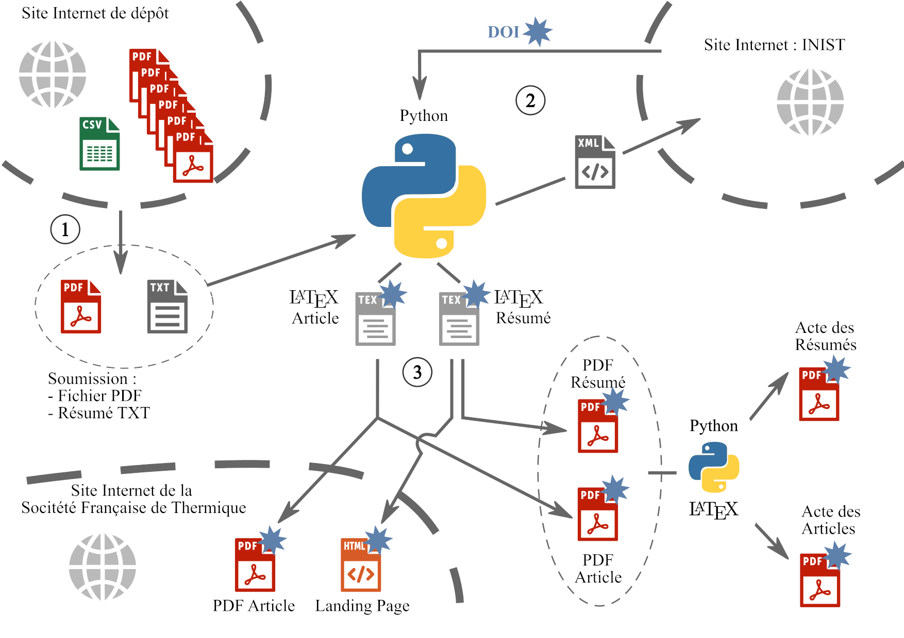

# Maker SFT

Ensemble de scripts pour la création des documents pour un Congrès de la Société Française de Thermique

Ce dépôt comporte l'architecture basique pour générer les recueils de résumés et d'actes pour le congrès de la SFT. Les abstracts sont ceux du congrès 2021 mais les fichiers PDF ne sont formés que d'une seule page. 

Pour générer il faut passer par 3 grandes étapes :

1. Utilisation de **make_recueils.py**  pour faire les recueils de résumés et les actes 
   
   1. il faut corriger les abstracts les infos au fur et à mesure.
   
   2. il faut compiler en LaTeX les recueils. Les commandes à taper dans la console sont affichées lors de l'exécution du script Python.
   
   3. il faut faire la table des matières via pandoc.

2. Les fichiers HTML doivent être uploadés sur le site de la SFT afin qu'ils fonctionnent.

3. Utilisation de **make_XML.py** pour faire les fichiers XML pour les DOI

